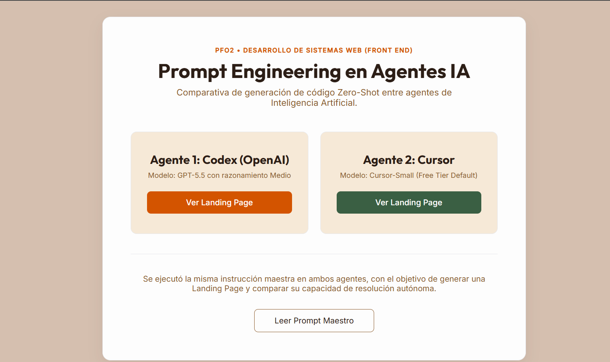

<div align="center"># 🌿 PFO2 - Prompt Engineering con Agentes de Inteligencia Artificial

## Landing Page - **Cosecha Dorada**
<br>


Desarrollo de una Landing Page completa mediante **Prompt Engineering** utilizando agentes de Inteligencia Artificial Generativa, sin modificaciones manuales sobre el código fuente generado.

**👤 Estudiante:** Mariana Aiello  
**🏫 IFTS N.º 29 – Comisión 2° D**  
**🌐 Deploy:** <a href="LINK_VERCEL"> Proyecto en Vercel</a>

<br>

</div>

---

## 📖 Descripción

Este proyecto fue desarrollado para el trabajo práctico **PFO2 - Prompt Engineering en Agentes de IA** de la materia Desarrollo de Sistemas Web (Front End) de la Tecnicatura en Desarrollo de Software del IFTS N.º 29.

El trabajo consiste en la generación automática de dos Landing Pages para la dietética premium Cosecha Dorada, utilizando un único Prompt Maestro ejecutado en dos agentes de Inteligencia Artificial distintos. El propósito es comparar los resultados obtenidos bajo las mismas condiciones de entrada, respetando la restricción de no modificar manualmente el código fuente generado.

<br>

---

## 🎯 Objetivo

Evaluar la capacidad de distintos agentes de Inteligencia Artificial para generar automáticamente una Landing Page a partir de un mismo Prompt Maestro, respetando las restricciones establecidas por la consigna.

A partir de ese mismo prompt se busca:

- Generar el sitio utilizando dos agentes de IA distintos.
- Comparar las soluciones obtenidas bajo las mismas condiciones de entrada.
- Analizar las diferencias en la interpretación del Prompt Maestro y en la implementación realizada por cada agente.
- Documentar el proceso de generación, organización y despliegue del proyecto.

<br>

---

## 🚀 Deploy

## Sitio principal

🔗 **Vercel**

> [Completar con el enlace]

La portada del proyecto permite acceder a:

- Landing Page generada por el Agente 1
- Landing Page generada por el Agente 2
- Prompt Maestro utilizado

<br>

---

## 👤 Datos de la Estudiante

<table>
  <tr>
    <td align="center" width="250">
      <a href="https://github.com/Aiello-M">
        
      </a>
      <br>
      <strong>Mariana Aiello</strong>
    </td>
    <td width="450">
      <strong>Institución:</strong> IFTS N.º 29<br>
      <strong>Materia:</strong> Desarrollo de Sistemas Web (Front End)<br>
      <strong>Comisión:</strong> 2° D<br>
      <strong>GitHub:</strong> <a href="https://github.com/Aiello-M">@Aiello-M</a><br>
      <strong>Repositorio:</strong> <a href="https://github.com/Aiello-M/PFO2-Landing-Aiello">PFO2-Landing-Aiello</a>
    </td>
  </tr>
</table>

---

## 📂 Estructura del repositorio

El repositorio integra la documentación del trabajo, el Prompt Maestro y las dos versiones generadas por los agentes de IA dentro de un único proyecto, accesibles desde una portada común.

```text
/
├── index.html                 # Portada principal
├── prompt.html                # Visualización del Prompt Maestro
├── css/
│   └── styles.css             # Estilos de la portada y documentación
│
├── agente1-codex/             # Landing page generada por Codex
│   ├── index.html
│   ├── styles.css
│   ├── main.js
│   └── img/
│
├── agente2-cursor/            # Landing page generada por Cursor
│   ├── index.html
│   ├── styles.css
│   ├── main.js
│   └── img/
│
└── README.md
```

<br>

---


## 💻 Tecnologías utilizadas

El proyecto fue desarrollado utilizando exclusivamente tecnologías web nativas, de acuerdo con las restricciones establecidas en la consigna.

### Desarrollo Web

- HTML5
- CSS3
- JavaScript (ES6+)

### Diseño

- Responsive Design
- Mobile First
- Flexbox
- CSS Grid
- Google Fonts (Outfit e Inter)

### Herramientas

- Git
- GitHub
- Vercel

### Inteligencia Artificial

- Codex (OpenAI)
- Cursor IDE
- Microsoft Designer (DALL·E 3)

### Prompt Engineering

- Prompt Maestro estructurado mediante etiquetas XML.

> **Nota:** No se utilizaron frameworks ni librerías externas (React, Vue, Angular, Bootstrap, Tailwind, jQuery, TypeScript, entre otros), respetando las restricciones establecidas en la consigna.

<br>

---

## 🤖 Agentes de Inteligencia Artificial utilizados

Para la generación automática de las Landing Pages se utilizó un único Prompt Maestro, ejecutado sin modificaciones sobre dos agentes distintos.

| Agente | Modelo |
| :--- | :--- |
| **Agente 1** | **Codex (OpenAI)** · GPT-5.5 (Razonamiento medio) |
| **Agente 2** | **Cursor IDE** · Cursor-Small (Plan Gratuito) |

Ambos agentes recibieron exactamente la misma instrucción inicial, permitiendo comparar posteriormente las diferencias en la interpretación del Prompt Maestro, la organización del código generado y las decisiones de diseño implementadas por cada modelo.

<br>

---

## 🛠️ Metodología de Desarrollo

El desarrollo del proyecto se llevó a cabo siguiendo un proceso organizado en distintas etapas, con el objetivo de mantener una única fuente de instrucciones para ambos agentes y documentar de forma transparente todo el flujo de trabajo.


### 1. Análisis de la consigna

* Se analizaron los requisitos funcionales, técnicos y de documentación solicitados para la actividad, prestando especial atención a las restricciones sobre tecnologías permitidas, estructura del proyecto y uso de agentes de Inteligencia Artificial.


### 2. Diseño del Prompt Maestro

* Se elaboró un Prompt Maestro estructurado utilizando etiquetas XML para organizar claramente cada bloque de instrucciones.

* Durante esta etapa se definieron, entre otros aspectos:

  - contexto del proyecto;
  - identidad de la marca;
  - sistema de diseño (colores, tipografías y estilo visual);
  - estructura completa de la Landing Page;
  - requisitos funcionales;
  - restricciones técnicas;
  - criterios de accesibilidad;
  - requisitos SEO;
  - formato exacto de salida esperado;
  - criterios de verificación antes de generar la respuesta.

El diseño del prompt tomó como referencia las buenas prácticas de Prompt Engineering publicadas por OpenAI y Anthropic para mejorar la claridad y reducir posibles ambigüedades.


### 3. Generación automática del código

* El prompt fue ejecutado de forma independiente en dos agentes de IA distintos.

* Cada agente generó automáticamente los archivos correspondientes al proyecto (`index.html`, `styles.css` y `main.js`) sin realizar modificaciones manuales posteriores sobre el código fuente.


### 4. Gestión de los recursos gráficos

* El prompt incluye una indicación a los Agentes de IA para incorporar comentarios HTML con descripciones detalladas en inglés de las imágenes a utilizar, junto a cada etiqueta ``.

* Las descripciones generadas por los agentes fueron utilizadas posteriormente como prompts en Microsoft Designer (DALL·E 3) para producir los recursos gráficos definitivos, respetando las rutas de imágenes previstas por el código generado y sin realizar modificaciones sobre dicho código.


### 5. Integración y despliegue

* Finalmente, los archivos generados se organizaron en un único repositorio de GitHub y se desplegaron mediante Vercel, incorporando una portada principal desde la cual es posible acceder a ambas Landing Pages y al Prompt Maestro.

<br>

---

##  📄 Prompt utilizado

Se presenta el siguiente Prompt Maestro ejecutado por ambos agentes de IA, conforme a las restricciones establecidas por la consigna.

<details>
  
<summary><strong>Ver Prompt Maestro completo</strong></summary>

```text
<context>
Act as an expert Front-End Development and UI/UX Design team.

Your task is to create a complete, professional, modern, and visually attractive Landing Page for a premium healthy food store called "Cosecha Dorada".

The website must transmit freshness, health, naturalness, quality, trust, and premium craftsmanship.

The result must be fully functional, visually engaging, production-ready, and suitable for deployment without manual modifications. </context>

<business_context>
Business Name: "Cosecha Dorada"

Concept:
A premium healthy food store offering fresh seasonal fruits, natural whole foods, artisanal jams, and organic packaged products.

The visual storytelling should connect fresh produce, sustainable agriculture, artisanal preparation, and healthy living.

Values:
Natural • Healthy • Fresh • Delicious • Honest • Sustainable

Target Audience:
Families, fitness enthusiasts, and health-conscious consumers seeking premium ingredients.

Tone of Voice:
Friendly, professional, inspiring, trustworthy, and authentic.
</business_context>

<branding>
Create a custom textual logo for "Cosecha Dorada" using HTML/CSS.

The logo should feel like a real premium food brand and be elegantly integrated into both the header and footer.

Avoid generic placeholder-style logos or basic text treatments. </branding>

<language>
Prompt instructions are written in English for clarity.

However, ALL user-facing content generated for the website MUST be written in Latin American Spanish (Español Latino), including:

* Navigation menus
* Headlines
* Subheadings
* Buttons
* Product names
* Product descriptions
* Testimonials
* Contact form labels
* Footer content
* SEO title
* Meta description
* Alt text

The generated HTML document MUST use:

<html lang="es">

The only content that may remain in English is the image-generation prompt written inside HTML comments. </language>

<design_system>
Style Direction:
Premium Organic Market with modern editorial influence.

The design should feel:

* Fresh and natural
* Warm and inviting
* Modern and premium
* Rich in visual depth
* Commercially polished
* Distinctive rather than template-like

Create a strong visual hierarchy and a memorable brand presence.

The page should not feel visually flat, repetitive, or monotonous.

Visual Design Guidelines:

* Use generous white space.
* Use subtle depth through shadows, layering, elevation, and composition.
* Use tasteful gradients where they improve atmosphere and visual hierarchy.
* Use modern rounded corners where appropriate.
* Use elegant visual contrast between sections.
* Some sections may use light backgrounds, while others may use richer warm tones, gradient backgrounds, darker accent backgrounds, or stronger visual treatments to create rhythm and separation.

The website should feel dynamic and visually engaging while remaining professional.

Avoid:

* Overly dark websites
* Excessive neon effects
* Excessive glassmorphism
* Heavy visual clutter
* Generic AI-generated layouts

Color Direction:

Primary Brand Colors:

* Orange #FF8C00
* Secondary Orange #F47A26
* Golden Accent #DFAF37
* Fresh Green #5FAF4A

These colors should guide the visual identity.

Additional complementary shades, gradient variations, highlights, shadows, overlays, and supporting colors may be introduced when they improve the overall design and remain consistent with the brand identity.

Typography:

Google Fonts:

Headings:

* Outfit (600–800)

Body:

* Inter (400–500)

The AI should determine appropriate font sizes, spacing, scale, and hierarchy to achieve excellent readability and modern visual impact.
</design_system>

<images>
Use ONLY local image paths.

Do NOT use external URLs.

Do NOT generate SVG placeholders, dummy illustrations, temporary visual blocks, or replacement images.

Only use the provided image paths exactly as specified.

Hero Section:

* img/hero-fruits.jpg

About Section:

* img/about-store.jpg

Categories Section:

* img/products-display.jpg

Jam Section:

* img/artisanal-jam.jpg

Featured Products:

* Naranjas Frescas → img/product-orange.jpg
* Frutillas → img/product-strawberry.jpg
* Granola Orgánica → img/product-granola.jpg
* Mermelada Artesanal de Naranja → img/product-orange-jam.jpg

Each product card MUST display its assigned image.

Do NOT reuse product images.

Immediately AFTER each  tag include an HTML comment containing a highly detailed English image-generation prompt describing:

* Professional food photography
* Commercial advertising quality
* Premium grocery presentation
* Natural golden-hour lighting
* Realistic textures
* Fresh ingredients
* Warm atmosphere
* Consistent visual style

  </images>

<required_sections>
Create the following sections:

1. Header

   * Logo
   * Navigation menu
   * Sticky behavior
   * Mobile hamburger menu

2. Hero Section

   * Strong headline
   * Supporting subtitle
   * Primary conversion-oriented CTA button
   * Featured image

   The CTA should encourage user action and business engagement.

   Examples:

   * Descubrir Colección
   * Comenzar Hoy
   * Elegir Productos Premium
   * Conocer Nuestra Selección

   Choose the CTA that best fits the brand and business goals.

3. About Us

4. Product Categories

   * Fresh Fruits
   * Whole Foods
   * Packaged Products
   * Artisanal Jams

5. Featured Products

   MUST include:

   * Naranjas Frescas
   * Frutillas
   * Granola Orgánica
   * Mermelada Artesanal de Naranja

6. Why Choose Us

7. Testimonials

8. Newsletter

9. Contact Form

   * Front-end only

10. Footer
    </required_sections>

<content>
Generate all content automatically.

Write original, realistic, persuasive, and commercially credible content.

Do NOT use:

* Lorem Ipsum
* Placeholder names
* Generic filler text
* John Doe
* Sample Company

Use realistic customer names commonly used in Spanish-speaking countries.

Testimonials may include:

* Customer name
* Profession
* Occupation
* Role
* Relevant context

to increase realism and credibility. </content>

<visual_enhancements>
Images should feel intentionally integrated into the design.

Use elegant framing techniques where appropriate:

* Refined image containers
* Soft shadows
* Subtle borders
* Layered compositions
* Premium presentation

Cards should feel interactive and modern.

Use:

* Hover elevation
* Shadow transitions
* Micro-interactions
* Subtle movement
* Visual depth

Avoid completely static-looking cards.

Use tasteful nature-inspired visual accents where appropriate.

Examples may include:

* Leaves
* Fruits
* Harvest-inspired icons
* Organic-themed SVG elements

These accents should reinforce the brand identity without becoming decorative clutter.
</visual_enhancements>

<interactions_and_animations>
Implement:

* Reveal on Scroll using IntersectionObserver
* Smooth transitions (300ms)
* Sticky header
* Mobile hamburger menu
* Hover effects
* Micro-interactions

Sections and cards should gracefully appear as the user scrolls.

Use subtle entrance animations such as:

* Fade-in
* Slide-up
* Staggered reveal

The page should feel alive and dynamic while remaining professional.
</interactions_and_animations>

<responsive_design>
Use a Mobile First approach.

Minimum breakpoints:

* Mobile: 320px+
* Tablet: 768px+
* Desktop: 1024px+

The layout must adapt correctly across all viewport sizes.
</responsive_design>

<accessibility_and_seo>

* Associate every form field with a label
* Meet WCAG AA contrast requirements
* Support keyboard navigation
* Use semantic HTML5
* Use proper H1-H3 hierarchy
* Include SEO title
* Include meta description
  </accessibility_and_seo>

<technical_constraints>
Use ONLY:

* HTML5
* CSS3
* Vanilla JavaScript (ES6+)

Do NOT use:

* React
* Vue
* Angular
* Bootstrap
* Tailwind
* jQuery
* TypeScript
* External icon libraries

Use inline SVG when icons are required.
</technical_constraints>

<output_format>
Return EXACTLY three complete code blocks in this order:

1. index.html
2. styles.css
3. main.js

The HTML file MUST reference:

<link rel="stylesheet" href="styles.css">
<script src="main.js" defer></script>

Do NOT embed CSS inside <style> tags.

Do NOT embed JavaScript inside <script> tags within index.html.

Do not return any text before, between, or after the code blocks.

Provide complete production-ready code.
</output_format>

<acceptance_criteria>
The solution is considered correct ONLY if:

✓ Header exists
✓ Hero section exists
✓ About section exists
✓ Categories section exists
✓ Featured products section exists
✓ Testimonials section exists
✓ Newsletter section exists
✓ Contact section exists
✓ Footer exists
✓ Responsive design is implemented
✓ Images use local paths only
✓ Content is realistic and written in Latin American Spanish
✓ No placeholder content remains
✓ Code is complete and functional
✓ Design demonstrates visual hierarchy, depth, and section contrast
</acceptance_criteria>

<verification>
Before returning the final answer:

1. Verify all acceptance criteria are satisfied.
2. Verify all visible content is written in Latin American Spanish.
3. Verify no placeholder content remains.
4. Verify visual depth and section contrast are present.
5. Verify the design feels like a real premium brand rather than a generic template.
6. Verify code quality, responsiveness, accessibility, and consistency.

If anything is missing or can be improved, fix it automatically.

Return ONLY the final validated solution. </verification>


```
</details>

<br>

---

###  🖼️ Gestión de imágenes

Todas las imágenes utilizadas por las Landing Pages fueron incorporadas mediante archivos locales, con el fin de obtener un resultado visual consistente y evitar dependencias de recursos externos.

El Prompt Maestro incluye las siguientes indicaciones:

- utilizar rutas locales para todas las imágenes;
- asignar nombres específicos para cada archivo;
- incorporar comentarios HTML con descripciones fotográficas detalladas en inglés junto a cada etiqueta ``.

Posteriormente, dichos comentarios fueron utilizados como prompts en **Microsoft Designer (DALL·E 3)** para generar los recursos gráficos definitivos, los cuales fueron incorporados al proyecto respetando las rutas establecidas por los agentes y sin modificar el código fuente generado.

<br>

---

##  📸 Capturas de pantalla

A continuación se presentan las capturas correspondientes a la portada del proyecto y a las dos Landing Pages generadas automáticamente por los agentes de IA.

### Portada principal


<br>

### Agente 1


<br>

### Agente 2


<br>


### 📊 Comparación general

| Característica      | Agente 1 | Agente 2 |
| ------------------- | :------: | :------: |
| HTML generado       |     ✅    |     ✅    |
| CSS generado        |     ✅    |     ✅    |
| JavaScript generado |     ✅    |     ✅    |
| Responsive          |     ✅    |     ✅    |
| Landing completa    |     ✅    |     ✅    |
| SEO básico          |     ✅    |     ✅    |
| Accesibilidad       |     ✅    |     ✅    |

<br>

---

## ✅ Checklist de Requerimientos Obligatorios

### Prompt Engineering

- ✔ Se diseñó un único Prompt Maestro.
- ✔ El Prompt Maestro fue utilizado sin modificaciones en ambos agentes.
- ✔ El prompt fue estructurado siguiendo buenas prácticas oficiales de Prompt Engineering.

<br>

### Landing Page

- ✔ Header con navegación.
- ✔ Hero Section.
- ✔ Sección institucional.
- ✔ Categorías de productos.
- ✔ Productos destacados.
- ✔ Beneficios.
- ✔ Testimonios.
- ✔ Newsletter.
- ✔ Formulario de contacto.
- ✔ Footer.

<br>

### Restricciones técnicas

- ✔ HTML5.
- ✔ CSS3.
- ✔ JavaScript Vanilla (ES6+).
- ✔ Responsive Design (Mobile First).
- ✔ Sin React.
- ✔ Sin Bootstrap.
- ✔ Sin Tailwind.
- ✔ Sin jQuery.
- ✔ Sin TypeScript.
- ✔ Sin librerías externas.

<br>

### Recursos gráficos
- ✔ Uso exclusivo de imágenes locales.
- ✔ Comentarios HTML con prompts fotográficos.
- ✔ Recursos gráficos generados externamente sin modificar el código generado por los agentes.

<br>

### Documentación
- ✔ Portada principal con acceso a los tres recursos solicitados.
- ✔ Prompt Maestro incluido.
- ✔ README del proyecto.
- ✔ Deploy unificado mediante Vercel.

<br>

---

# 📝 Conclusiones

El desarrollo del proyecto permitió aplicar técnicas de Prompt Engineering para diseñar una instrucción única capaz de generar automáticamente una Landing Page completa mediante distintos agentes de Inteligencia Artificial.

La utilización del mismo Prompt Maestro en ambos modelos permitió comparar sus resultados bajo condiciones equivalentes, analizando diferencias en la interpretación de las instrucciones, la organización del código y las decisiones de diseño adoptadas por cada agente.

La experiencia evidenció la importancia de la precisión, la estructura y el nivel de detalle del prompt como factores determinantes en la calidad del resultado generado, especialmente en escenarios donde no se permite realizar modificaciones manuales sobre el código producido.

```
